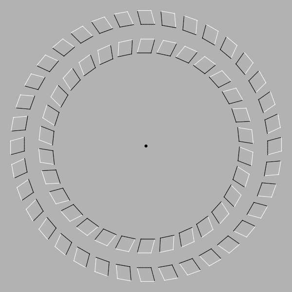

# cfgd
Some (very) old Context Free Art codes (https://www.contextfreeart.org/).

# images

## doyle spiral 1

## doyle spiral 2

## doyle spiral 3

## doyle spiral 4

## doyle spiral 5

## chose bizarre

## colors

## dragon

## fractale 1

## fractale 3

## fractale 6

## fractale 7

## gold number

## heart

## illusion optique 5

## illusion optique 7

## illusion optique 10

## illusion optique 12

## L-system 2

## L-system 4

## nice shape 4

## triangle sierpinski 2

## triangle sierpinski base carre

## triangle sierpinski base cercle

## triangle sierpinski base triangle
